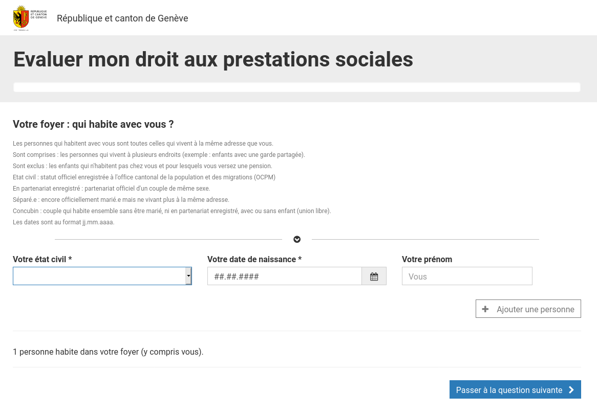

# Questionnaire d'éligibilité (QELI)

- [Présentation de l'application](#prsentation-de-lapplication)
- [Liste de modules](#liste-de-modules)
- [Construction](#construction)
- [Démarrage](#dmarrage)
- [Livraison](#livraison)
- [Astuces](#astuces)

# Présentation de l'application

Le questionnaire d'éligibilité aux prestations sociales est une e-démarche développée
par l'Etat de Genève pour permettre aux citoyens de déterminer en ligne leur
potentielle éligibilité à différentes prestations sociales offertes par le canton :

- Subside d'assurance-maladie, délivré par le [service d'assurance maladie
  (SAM)](https://www.ge.ch/organisation/service-assurance-maladie).
- Avance de pensions alimentaires, délivrée par
  le [service d'avances et recouvrement de pensions alimentaires (SCARPA)](https://www.ge.ch/pensions-alimentaires-impayees)
  .
- Allocation logement, délivrée
  par [l'office cantonale du logement et de la planification foncière (OCLPF)](https://www.ge.ch/organisation/office-cantonal-du-logement-planification-fonciere)
  .
- Prestations complémentaires AVS/AI, délivrées par
  le [service des prestations complémentaires (SPC)](https://www.ge.ch/organisation/service-prestations-complementaires)
  .
- Bourse d'études, délivrée par le [service des bourses et prêts d'études
  (SBPE)](https://www.ge.ch/obtenir-bourse-pret-etudes-apprentissage).
- Prestations complémentaires familiales, délivrées par
  le [service des prestations complémentaires (SPC)](https://www.ge.ch/organisation/service-prestations-complementaires)
  .
- Aide sociale, délivrée par [l'hospice général](https://www.hospicegeneral.ch/).

L'éligibilité aux prestations est déterminée par le formulaire en fonction de la
situation des personnes constituant le foyer du demandeur, en suivant les règles
métier définies par chacun des services délivrant des prestations.

Le questionnaire a été développé à l'initiative de l'office de l'action, de
l'insertion et de l'intégration sociale (OAIS) afin notamment de réduire le
non-recours aux prestations sociales. Son implémentation a été assurée par l'office
cantonale des systèmes d'information et du numérique (OCSIN).



# Liste des modules

- [qeli-frontoffice-application](qeli-frontoffice-application) : construction et
  livraison du front office, en vue de son déploiement.
- [qeli-frontoffice-cypress](qeli-frontoffice-cypress) : configuration des scenarii
  de tests d'intégration du front office.
- [qeli-frontoffice-ihm](qeli-frontoffice-ihm) : IHM du front office, destiné aux
  gestionnaires.
- [qeli-frontoffice-rest](qeli-frontoffice-rest) : services REST du front office.
- [qeli-frontoffice-service](qeli-frontoffice-service) : implémentation de la couche
  métier du front office.
- [qeli-frontoffice-service-api](qeli-frontoffice-service-api) : interface de la
  couche métier du front office.

# Construction

## Pré-requis

- JDK 8+
- Maven
- Node

## Comment construire

```bash
mvn clean install
```

En cas d'erreurs pour cause d'accès Internet, voir notamment le chapitre "Astuces"
dans le fichier
[README.md](./qeli-frontoffice-cypress/README.md) du module `qli-frontoffice-cypress`
.

# Démarrage

Pour démarrer l'application, exécuter la commande suivante :

```bash
cd qeli-frontoffice-application
mvn spring-boot:run
```

#### Rest API

Le REST API sera disponible sur http://localhost:8080/socialqeli_pub/api/.

#### IHM

L'IHM sera disponible sur http://localhost:8080/socialqeli_pub/formulaire/.

#### Frontend

Pour démarrer uniquement le frontend en local, exécuter la commande suivante :

```bash
cd qeli-frontoffice-ihm
npm run start
```

L'application web application sera disponible sur :
[http://localhost:4200](http://localhost:4200).

# Livraison

La stratégie de branching de l'application est Git flow.

Pour livrer une nouvelle version il suffit de suivre le workflow release. Un plugin
Maven a été rajouté pour faciliter cette tâche.

- Pour créer une branche de release, exécuter la commande suivante :

```bash
mvn gitflow:release-start
```

- Une fois que le code est stable, on peut figer un tag et publier la nouvelle
  version en exécutant la commande suivante :

```bash
mvn gitflow:release-finish
```

- Il est aussi possible de faire une release d'un coup (sans création de release
  branch) en exécutant la commande suivante :

 ```bash
mvn gitflow:release
```

Pour le mode non-interactif, il faut rajouter l'argument `-B` ; si le paramètre
`releaseVersion` n'est pas défini, la version par défaut sera utilisée :

 ```bash
mvn -B gitflow:release
```

## Références

- Gitflow cheatsheet : https://danielkummer.github.io/git-flow-cheatsheet/
- Gitflow maven plugin : https://github.com/aleksandr-m/gitflow-maven-plugin

## Livrable standalone (Windows)

Pour construire un livrable Windows, exécuter la commande suivante :

```bash
mvn clean package -Pstandalone,default
```

Avec un proxy il faut éxecuter cette commande ainsi :

```bash
export JVM_PROXY_FLAGS="-Dhttp.proxyHost=$HTTP_PROXY_HOST  \
                        -Dhttp.proxyPort=$HTTP_PROXY_PORT  \
                        -Dhttps.proxyHost=$HTTP_PROXY_HOST \
                        -Dhttps.proxyPort=$HTTP_PROXY_PORT"

mvn clean package -Pstandalone $JVM_PROXY_FLAGS
```

Un livrable Windows en format `ZIP` sera disponible sur :
`qeli-frontoffice-application/target/qeli-frontoffice-application-windows.zip`.

Décompresser le fichier et faire un double clic sur le fichier
`qeli-frontoffice-application.cmd` pour démarrer le server en mode standalone.

L'IHM est disponible sur: http://localhost:8080/socialqeli_pub/formulaire.

Pour arrêter le server, fermer la fenêtre du terminal.

## Livraison OCSIN

Pour construirer le livrable et démarrer l'application en interne il suffit d''
activer le profile `ocsin`, par exemple :

```bash
mvn clean package -Pocsin
```
## Particularité open source ##

Si vous avez cloné ce dépôt Git depuis la page GitHub de l'État de Genève
et que vous vouliez construire l'application avec Maven, vous devez
surmonter un écueil.
En effet, pour fonctionner l'application a besoin des fichiers
`botdetect-<VERSION>.jar` et `botdetect-servlet-<VERSION>.jar`.
Or, si le
[site de Captcha](https://captcha.com/java-captcha.html) précise
"You can download BotDetect Java CAPTCHA library for free and use it immediately",
Captcha ne met pas à disposition les deux fichiers JAR dans Maven Central ni dans
un dépôt Maven maison.
Par conséquent, avant de lancer votre commande `mvn`, vous devez télécharger
puis installer dans votre dépôt Maven les deux fichiers JAR.
La version à sélectionner est fournie par la propriété
`botdetect-servlet.version` indiquée dans le fichier
[pom.xml](./pom.xml)
de ce projet-ci.

Il est par ailleurs recommandé de prendre connaissance de la
[licence](https://captcha.com/license/captcha-licensing.html)
de BotDetect Captcha.

## Astuces

### Références de la charte graphique

- https://outil.ge.ch/site/charte-internet/
- https://outil.ge.ch/site/charte-internet/version/2.4/

### Sauter les tests

L'argument `skipTests` désactive tous les tests pendant la compilation :

```bash
mvn clean install -DskipTests=true
```

Il est aussi possible de désactiver les tests Java et Cypress individuellement :

* `cypress.test.skip` : désactive les tests d'intégration Cypress. Exemple :
  `mvn clean install -Dcypress.test.skip=true`
* `surefire.test.skip` : désactive les tests Java. Exemple :
  `mvn clean install -Dsurefire.test.skip=true`

### Sauter la compilation de l'IHM

Il est possible de construire l'application en sautant la compilation de l'IHM. Poour
cela, exécuter la commande suivante :

```bash
# Sauter la compilation de l'ihm
mvn clean install -pl '!qeli-frontoffice-ihm'

# Sauter la compilation des tests d'intégration
mvn clean install -pl '!qeli-frontoffice-cypress'

# Sauter la compilation de l'IHM et des tests d'intégration
mvn clean install -pl '!qeli-frontoffice-ihm,!qeli-frontoffice-cypress'
```

### Style du code

Le style du code est défini par le fichier [.editorconfig](.editorconfig) à la racine
du projet.

Pour certains IDE il faut installer un plugin qui permettra son intégration.

L'information sur le format, les IDE et plugins compatibles se trouve ici :
https://editorconfig.org.

### Configuration de Node

Remplir le fichier `~/.npmrc` avec la configuration suivante :

```bash
cafile=/path/to/ge-app.pem
http-proxy=http://localhost:3128
https-proxy=http://localhost:3128
proxy=http://localhost:3128
strict-ssl=false
registry=***REMOVED***/content/repositories/npmjs/
 ```

### Problèmes avec node-sass

En cas de problème avec node-sass, exécuter la commande suivante :
`npm rebuild node-sass`.

### Utiliser un domaine pour l'IHM

Utile pour tester le partage de cookie entre le domaine principal et un sous-domaine.

Configurer un host personnalisé, par exemple :

```
127.0.0.1   localqeli.etat-ge.ch
```

* *Windows : C:\Windows\System32\drivers\etc\hosts*
* *Linux : /etc/hosts*

Puis lancer l'IHM avec la commande :

```bash
cd qeli-frontoffice-ihm
npm run start-host
```
